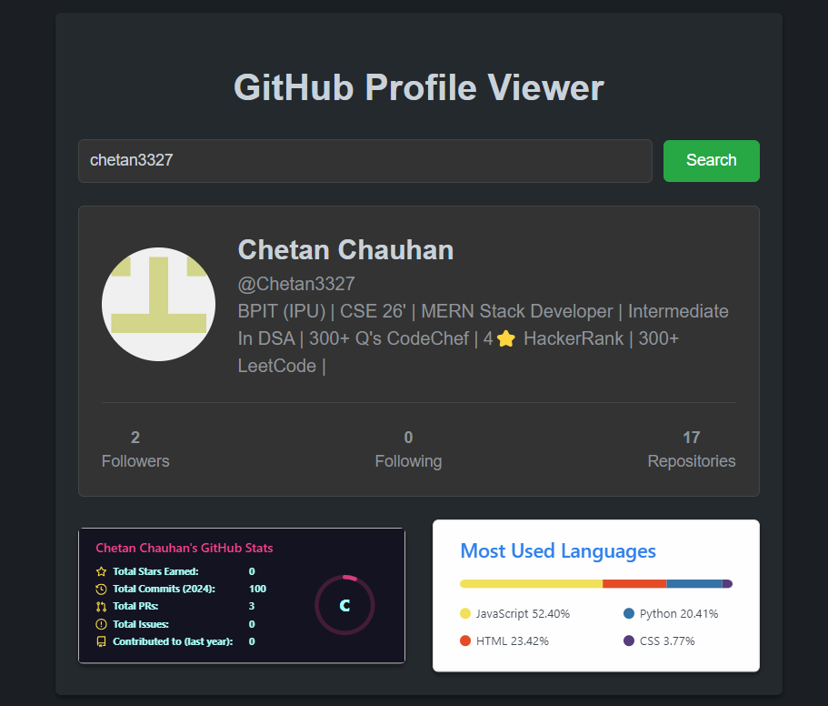

<!-- ABOUT THE PROJECT -->
# Github Profile Viewer


The GitHub Profile Viewer App is a web application that allows users to view GitHub user profiles. Users can enter a GitHub username, and the app fetches the user's profile information using the GitHub API. The app is built using React and Axios for making API requests.

Use the `README.md` to get started.

<!-- BUILT WITH -->
# Built With

The Tech Stacks used are:

<div align="center">
  <a href="https://skillicons.dev">
      
  </a>
</div>

## Installation

1. Clone the repository to your local machine:

   ```bash
   git clone https://github.com/Chetan3327/github-profile-viewer.git
   ```
2. Navigate to the project directory:

   ```bash
   cd github-profile-viewer
   ```
3. Install dependencies:

   ```bash
   npm install
   ```

<!-- CONTACT -->
# Contact

Name: Chetan Chauhan - chauhanchetan12789@gmail.com

Project Link: https://65c64c7e55410b111c66ee45--github-profile-viewer-3327.netlify.app/